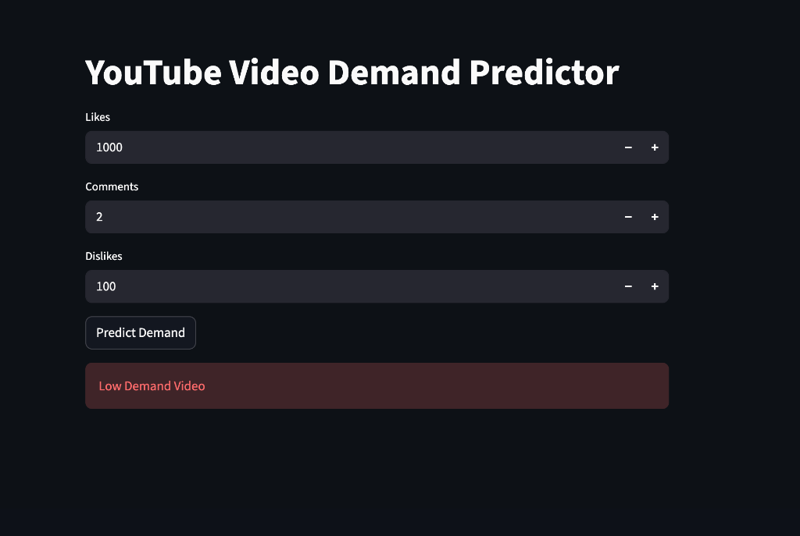

# YouTube Video Demand Predictor 🚀

A machine learning-powered application designed to predict the demand for YouTube videos based on engagement metrics. This tool helps content creators and digital marketers optimize their content strategy by understanding potential audience reach.



---

## 💼 Business Problem Statement

In the hyper-competitive landscape of digital content, creators and media companies face a significant challenge: **Predicting Content Success**. With millions of videos uploaded daily, the ability to forecast whether a video will achieve "High Demand" or "Low Demand" is crucial for:
- **Resource Allocation**: Deciding which topics warrant higher production budgets.
- **Strategic Planning**: Optimizing upload schedules and content types.
- **Risk Mitigation**: Avoiding investment in low-engagement content.

This application provides a data-driven approach to solve this by analyzing historical engagement patterns.

---

## 📉 Economic Concepts Applied

The project integrates several fundamental economic principles to analyze digital content performance:

1. **Demand Estimation**: We treat a "View" or "Engagement" as a unit of demand. The model attempts to estimate the future demand curve of a video based on initial engagement signals (Likes, Comments, Dislikes).
2. **Proxy for Utility**: User engagement (Likes and Comments) serves as a proxy for the **Marginal Utility** provided by the content. High engagement indicates high consumer satisfaction and perceived value.
3. **Opportunity Cost**: For creators, time is a finite resource. By predicting demand, the tool helps minimize the **Opportunity Cost** of producing content that fails to capture market interest.
4. **Value-to-Engagement Mapping**: The "Engagement Rate" (calculated as a ratio of interactions to total feedback) represents the **Conversion Efficiency** of a video's audience.

---

## 🤖 AI Techniques Used

The backend leverages modern machine learning techniques to provide accurate predictions:

- **Supervised Learning**: The model was trained on a labeled dataset of YouTube metrics where video performance was categorized into High/Low demand.
- **Classification Model**: A robust classification algorithm (implemented via `scikit-learn`) is used to draw a decision boundary between successful and unsuccessful videos.
- **Feature Engineering**: 
    - **Engagement Rate**: A synthesized feature calculated as `(Likes + Comments - Dislikes) / (Likes + Comments + 1)`, which captures the sentiment of the audience.
    - **Normalization**: Input features are scaled to ensure the model isn't biased by large numeric differences between likes and comments.
- **Model Serialization**: Using `joblib`, the trained model is serialized into `model.pkl` for efficient serving in the Streamlit frontend.

---

## 🚀 How to Run Locally

1. **Clone the repository**:
   ```bash
   git clone https://github.com/Vink-135/yt_ml.git
   cd yt_ml
   ```

2. **Set up a virtual environment**:
   ```bash
   python3 -m venv venv
   source venv/bin/activate
   ```

3. **Install dependencies**:
   ```bash
   pip install -r requirements.txt
   ```

4. **Launch the app**:
   ```bash
   streamlit run app.py
   ```

---

## 🌐 Deployment

This app is designed for easy deployment on **Streamlit Cloud**. See [deployment_guide.md](deployment_guide.md) for a detailed step-by-step guide.
